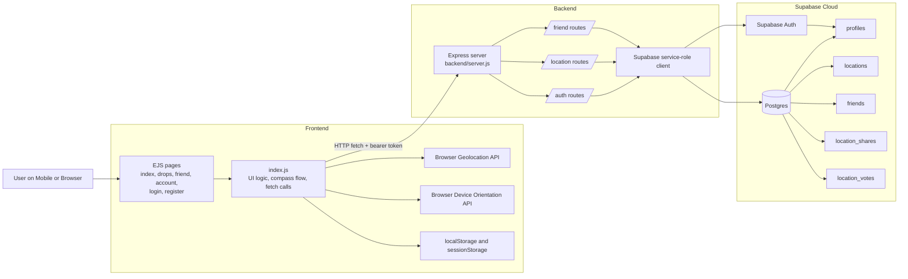

# Waypoint

Waypoint is a mobile-first location-sharing web app for saving personal spots, navigating back to them with a compass-style finder, and discovering public places shared by the community.

It is built with Express, EJS, browser JavaScript, and Supabase Auth/Postgres.

## Features

- Save your current GPS position as a named spot
- Navigate back to a spot with a live compass and distance readout
- Keep spots private or make them public
- Categorize saved locations
- Share saved spots with friends
- Send and manage friend requests
- Explore nearby public spots by category and distance
- Upvote or downvote public destinations

## Tech Stack

- Frontend: EJS templates, vanilla JavaScript, CSS
- Backend: Node.js, Express
- Database/Auth: Supabase Auth + Supabase Postgres
- Dev tooling: Vite, Nodemon
- Browser APIs: Geolocation API, Device Orientation API

## Project Structure

```text
backend/
  route/
    auth.js
    friend.js
    location.js
  supabase/
    db.js
    schema.sql
    location_votes_migration.sql
    suggestion_seed.sql
  server.js

frontend/
  account.ejs
  drops.ejs
  friend.ejs
  index.ejs
  index.js
  login.ejs
  register.ejs
  shared_locations.ejs
  supabaseClient.js
```

## Architecture



## Getting Started

### 1. Install dependencies

```bash
npm install
```

### 2. Create `.env`

Create a `.env` file in the project root:

```env
SUPABASE_URL=https://your-project.supabase.co
SUPABASE_SERVICE_ROLE_KEY=your-service-role-key
PORT=3000
HOST=0.0.0.0
```

Notes:

- `SUPABASE_SERVICE_ROLE_KEY` is required by the backend in `backend/supabase/db.js`.
- The frontend Supabase public client is currently configured in `frontend/supabaseClient.js`.

### 3. Set up Supabase schema

Run these SQL files in the Supabase SQL editor:

1. `backend/supabase/schema.sql`
2. `backend/supabase/location_votes_migration.sql`
3. `backend/supabase/suggestion_seed.sql` (optional sample data)

The seed file is useful if you want public locations and vote data for testing suggestions.

### 4. Start the app

For development:

```bash
npm run dev
```

For production build:

```bash
npm run build
npm start
```

The app runs by default on:

```text
http://localhost:3000
```

## Supabase Tables

The app uses these main tables:

- `profiles`: user profile linked to `auth.users`
- `locations`: saved spots with coordinates, privacy, and category
- `friends`: friend requests and accepted relationships
- `location_shares`: shared saved spots between users
- `location_votes`: upvotes and downvotes for public locations

## Main User Flows

### Register and Login

- User signs up or logs in through `/auth`
- Supabase Auth returns a session token
- The frontend stores and reuses the access token for protected requests

### Save a Spot

- Browser gets the current GPS position
- Frontend sends `name`, `lat`, and `lng` to `/location`
- Backend verifies the token and inserts a row into `locations`

### Find a Spot

- User taps `Find` on a saved, shared, or public location
- Frontend opens compass mode
- Browser Geolocation and Device Orientation drive the live arrow and distance view

### Discover Public Spots

- Frontend sends current coordinates, category, and distance filter to `/location/suggestions`
- Backend ranks public locations using distance and vote totals

### Share With Friends

- User sends a friend request by username
- Accepted friends can receive locations through `location_shares`

## Mobile Testing Notes

- Compass and GPS access on phones usually require HTTPS.
- Localhost on a laptop works for development, but phone sensors often need a secure tunnel.
- The app binds to `0.0.0.0` in development so it can be opened from other devices on the same network.

## Current Limitations

- There is no automated test suite yet.
- Frontend Supabase public config is stored directly in `frontend/supabaseClient.js`.
- Mobile compass behavior depends on browser permissions and sensor support.

## Scripts

```bash
npm run dev
npm run build
npm start
```

## Related Docs

- `project-writeup.md`
- `system-architecture.md`
