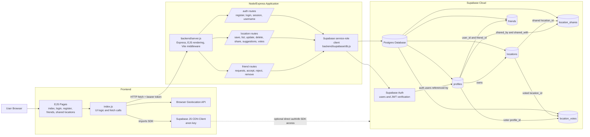

# System Architecture

## Component Summary

- **Frontend:** EJS views in `frontend/` render pages for navigation, authentication, friends, and shared locations. `frontend/index.js` handles UI interactions, browser geolocation, local/session storage, and API calls.
- **Backend:** `backend/server.js` runs Express, renders EJS pages, serves Vite middleware during development, and mounts `/auth`, `/location`, and `/friend` routers.
- **Authentication:** The backend uses Supabase Auth to register, log in, verify JWT bearer tokens, and connect authenticated users to `profiles`.
- **Data Storage:** Supabase Postgres stores user profiles, saved locations, friend relationships, shared locations, and location votes.
- **External Services:** The app depends on Supabase Cloud for authentication and database access, the browser Geolocation API for latitude/longitude, and the Supabase JS CDN package loaded by `frontend/supabaseClient.js`.

## Main Request Flows

1. **Register/Login:** Browser submits credentials to `/auth/register` or `/auth/login`; Express calls Supabase Auth; the frontend stores the returned access token.
2. **Save Location:** Browser reads coordinates from Geolocation, sends them with the access token to `/location`; Express verifies the token and inserts a row in `locations`.
3. **Friends and Sharing:** Browser calls `/friend/*` to manage friend relationships, then `/location/share` to create `location_shares` records.
4. **Suggestions and Voting:** Browser sends current coordinates and filters to `/location/suggestions`; Express reads public locations, computes distance and ranking, joins vote totals, and returns suggestions. Votes are saved through `/location/:id/vote`.
